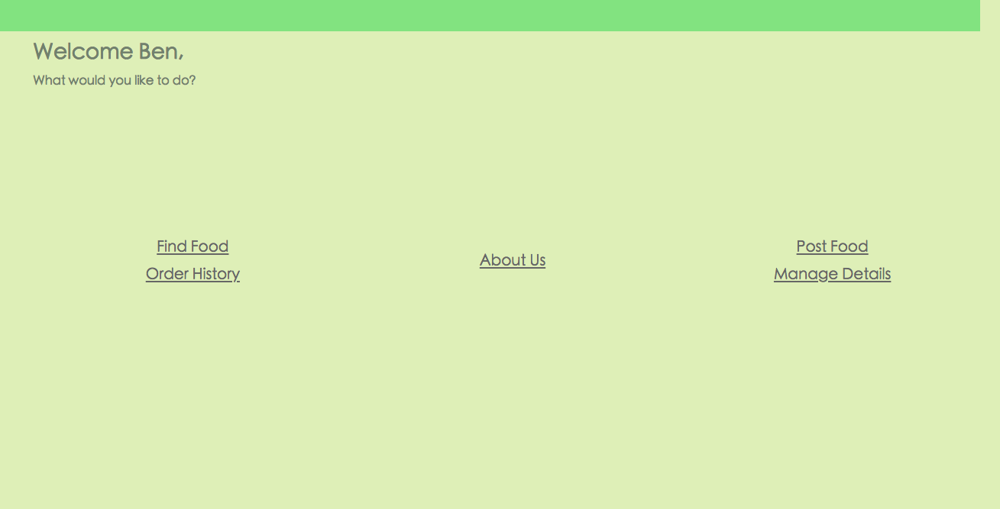
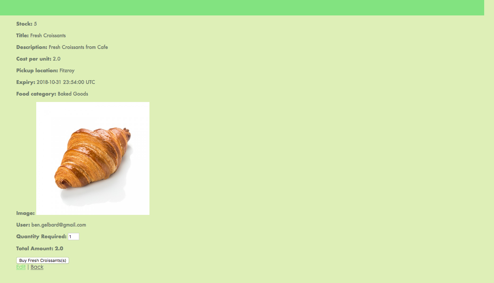
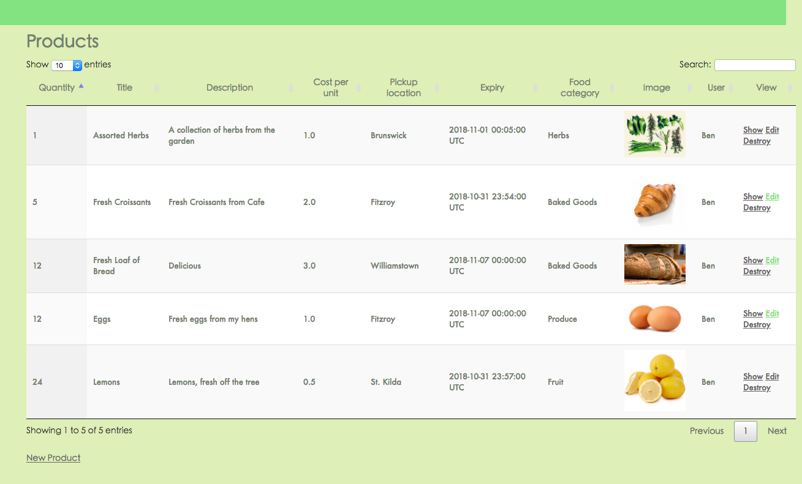
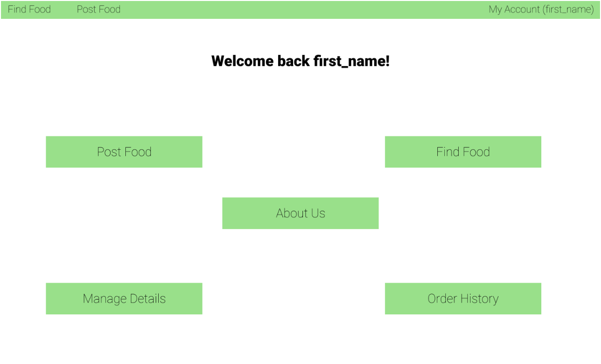
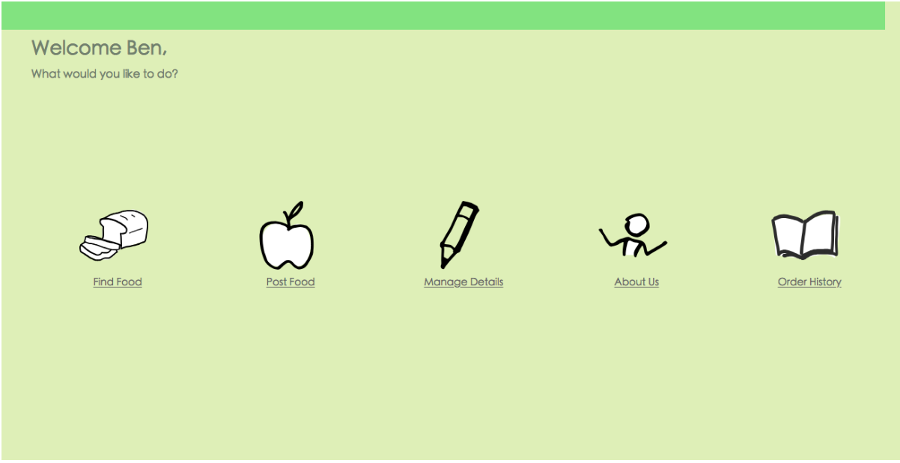
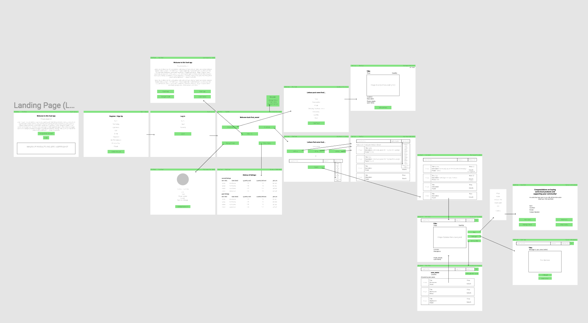
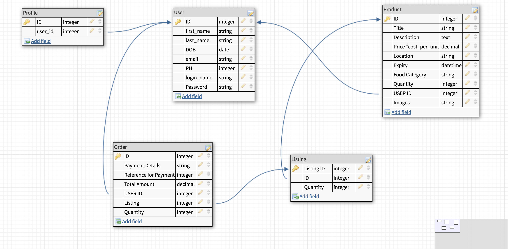
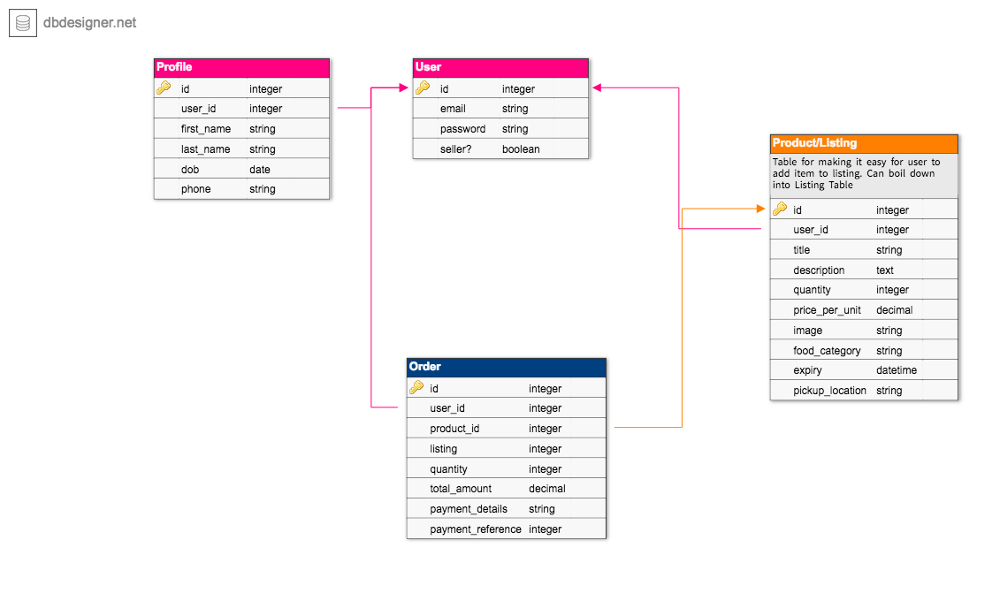

# Foodtopia README
Link to web application: [LINK](https://obscure-sands-49263.herokuapp.com)

Link to GitHub respository: [LINK](https://github.com/dlim28/food-marketplace)

# Description of the project

## Description
```
This project (Foodtopia) is a marketplace that allows local people to be able to sell or buy local produce within their surrounding area. 

It resolves a problem where there is a food wastage in australia as local produce gets thrown away due to excess and unable to be sold. There is certainly a demand to have local farmers or growers sell off their produce and may not have business savvy to sell their products.

Likewise people who prefer local or organically grown produce may use the site to find local farmers wishing to sell their products
```

## Functionality
```
As the site is a marketplace, there will be two sides to this particular website. When someone creates an account they can both be a seller or a buyer.

As a buyer the user can search for products, look at a particular product, purchase a product and look at their order history.

As a seller the user can make a listing of the product they want to sell, they can edit the listing that they have made and view the listings they currently have active. Since the seller is also a buyer they would also have the functionality of a buyer.
```

## Screenshots
>**Landing Page**



>**Product Page**



>**Product Listing Page**



## Tech Stack
```
The tech stack surrounding the website are as follows:

Ruby / Ruby on Rails: The back-end of the website will be programmed using rails.

HTML / CSS: HTML will be used to format the website using erb files within rails. CSS will be used to style the web site.

Postgresql: We will be using postgresql to support the website database.

The live service will be deployed on a cloud platform called Heroku.
```

## Instructions
> **Signing Up**
```
There are 2 ways to reach the sign up page. One way is to click on log in on the upper right of the homepage and then click on "Sign Up" within the log in page. 

The other way is to click on the button in the middle of the homepage "Hungry, Broke and Local?" which will then lead to the sign up page directly
```

> **Editing Personal Information**
```
Once logged in, you will immediately be sent to a landing page that will have a button that says "Manage Details". Clicking on this will allow you to change what ever details you want and allow you to save your details.

Alternatively there is a "Edit Account" button just under the logout button that will redirect you to the edit details page
```

>**Buying**
```
To purchase a product you will need to navigate to the "Find Food" page which can be found on the navbar.

Here all the foods listed will be displayed. If there is a particular food you wish to purchase you can use the search bar to filter out the listings.

Clicking on "Show" will take you to the product page where you can purchase the product and the amount you wish to purchase. The stripe checkout will handle the credit card verification process.

Once stripe has successfully charged you, you are then lead to a receipt page where you can then review your purchase
```

>**Selling**
```
Up on the navigation bar there is a link that says "Post Food"

This link will direct you to the new listing page where you can upload all the information of the produce you wish to sell.

Once listed it will be put on the "Find Food" page
```

>**Viewing past orders**
```
You can view past orders by clicking on your name on the upper right of the screen.

This will lead you to a personal page where you can do some admin on your profile.

One of the links is called "Order History" which will show your purchase history.
If you have put up listings, you will also see your current listings that are still active as well.
```
# Design Documentation

## Design Process
>Database
```
The design of the database was to follow a model that most online marketplaces would have. 
We designed the database to include the following:

- Profile
- User
- Order
- Product

Product: This is the table where products gets recorded in. All foods or items will be recorded as a product with an associated user (user id) as the original poster

Order: The order table is there to made records of the purchases that the user would have made. It is associated by a user as well as a product (The purchased product)

User: The user table is what will handle the authentication of the website

Profile: The profile table is what controls the personal information for the website. We decided to split the two because it would be more secure if the table for authentication is seperate from personal data. Should there be a breach the personal data would technically be seperate from the user table.

** note: the Profile table was made redundant, and all user data was placed into the User table as there were issues with accessing the two tables on forms/pages. Effort was expended trying to make this work, but in the end we had to have all the User data in the one table. The closest solution I got to was have the Profile table be a sub-class of the User table, and then have a piece of code that would prevent the columns from the User table being inherited into the profile table. With more time, I am are sure that a solution would have been discovered.
```

>HTML/CSS

We made a wireframe, and just used a light green just to have an idea of where things would be. The green we chose stuck and we ended up just following the rough draft we made with the wireframe.
Original Wireframe:

https://www.figma.com/file/HExSLkrIrFk4pk093uaNU5LA/Venturetopia?node-id=0%3A1

The main homepage took a transformation from:


To a much easier to use:


We decided to grab images from The Doodle Library (https://www.thedoodlelibrary.com) for some light hearted and simple images to keep up the theme (all current images by Adi Ben-Hur).

## User Stories
```
The user stories that we did were mainly done using the following format:

As a <WHO> I should be able to do <WHAT> so that <REASON>

This format allowed us to easily create generic use cases that could easily build the web app
```
>Link to User Stories document [LINK](https://docs.google.com/document/d/1mt5UJZ15mcWQsgtTvX4b6akVUfdxBVfHIAxipxEv_gA/edit)

## User Workflow Journey/s


## Wireframes
```
The wireframes we completed showed us a rough idea on where we should place our content as well as showed the general navigation
```
>Wireframe



## Database Entity Relationship Diagrams
>**Initial ERD**



>**Final ERD**



# Project Management

## Plan and Timeline
```
The project was to take place over 2 weeks with a deadline of Friday 9th of November

It was agreed that we would use the first week to have the minimum viable product (MVP) ready and deployed in working order.

The next week would see that we would have styling for the website completed. This would be completed using CSS.
To be completed would also be the admin work for the project such as the README file and ensuring that the deployment would work correctly

In order to manage the project we will be using Trello. The use of trello will allow us to manage the project by adding in the user stories as tasks and building that particular user story in the app.

We had assigned one person per user story and within each user story there would be a checklist of "Things to Do" that would meet the minimum requirement for the user story to be completed
```

>Trello


# Short Answer Questions

1. **What is the need (i.e. challenge) that you will be addressing in your project?**
```
People grow food, but often they grow too much, or it becomes ripe all at once. Ventopia allows growers to connect to consumers, and sell the excess produce from their gardens, before it goes off.
Additionally Ventopia allows for cafes restaurants to alert users to products going off that they want to sell cheap.
```

2. **Identify the problem you’re trying to solve by building this particular marketplace App? Why is it a problem that needs solving?**

```
The problem is that there is a lot of excess food that gets wasted every year. For example the Huffington Post reports that Australians waste $10 billion a year on food that’s thrown away. Our app plans to reduce that.
```
>Link to Article: [LINK](https://www.huffingtonpost.com.au/2017/10/24/australians-throw-away-nearly-10-billion-in-food-waste-each-year_a_23253505/)


3. **Describe the project will you be conducting and how your App will address the needs.**
```
The app will provide an online marketplace for consumers and growers to connect with each other and buy/sell produce.
```

4. **Describe the network infrastructure the App may be based on.**
```
The app will be using rails to provide the infrastructure of the network connectivity.

The production service will deployed on a cloud platform called Heroku.

Heroku is a cloud platform as a service (PaaS) that will allow us to develop, run and manage our application.
```

5. **Identify and describe the software to be used in your App.**
```
The following will be used in order to build the web application:
- Ruby on Rails (Server application)
- Ruby (Server side language)
- CSS (SASS) (Styling) 
- HTML (Web formatting and display)
```

6. **Identify the database to be used in your App and provide a justification for your choice.**
```
The database chosen will be postgresql. The reasoning behind the choice is due to the strong community support and backing of the rails community.
As a RDBMS it has the best scalable stack when it comes to database complexity. Should the app be more complex over time postgresql will be able to handle it better than most other RDBMS
```

7. **Identify and describe the production database setup (i.e. postgres instance).**
```
The models/database will be built using postgresql. As it is a relational database the models will be linked to each other with foreign keys so that there will be some association to it.

Since it is a database the models will store records that will need to be accessed. Postgreesql will ensure that the tables and records will be indexed appropriately.
```

8.  **Describe the architecture of your App.**
```
We will have the following models/database that relate to the app:

- Profile
- User
- Product
- Order

Profile: This table will specifically handle the user details such as the name, location, contact number, date of birth etc...

User: This particular table is what will specifically handle the authentication of the app. Eg, Username, email, password etc...

Product: This table will serve as the main table that everyone will see. each product listed in the app will have their own record in this table.

Order: This table will record down the user's purchases at the time of checkout. It will allow the user to keep track of purchases
```

9.  **Explain the different high-level components (abstractions) in your App.**
```
For this app we have used a few Ruby gems in order to rapidly build up the applicaiton. Ruby gems are a package which can provide a framework to build from. Since we are using rails which is built and uses ruby, the gems can easily be integrated to any Ruby on Rails application

Another abstraction that we will use heavily is Active Record. This particular class is an abstraction of SQL and it allows us to run SQL queries while using the Ruby language.
```

10. **Detail any third party services that your App will use.**
```
Heroku as a cloud service for deployement

Ruby Gems:
- Devise
- Pundit
- GeoLocator
- Stripe
```

11. **Describe (in general terms) the data structure of marketplace apps that are similar to your own (e.g. eBay, Airbnb).**
```
The marketplace we are trying to build would be structured similar to what is available in Gumtree.
Just like Gumtree the site we are building is a classifieds but for local produce.

Therefore the data structure will also be similar. These include having a product page, order history as well as user profiles.
```

12. **Discuss the database relations to be implemented.**
```
The database models are associated with a one to many relationship. There are no instances where we have a many to many relationship that will require a join table
```

13. **Describe your project’s models in terms of the relationships (active record associations) they have with each other.**
```
The models have the following relationships:

Profile -> User: One-to-One
User -> Product: One-to-Many
User -> Order: One-to-Many
Order -> Product: One-to-One
```

14. **Provide your database schema design.** 
> [Database Schema Design](https://drive.google.com/open?id=1BVTS3_aZ3Bzpo_T6LtejzJoUtx2n9dnF)

15.  **Provide User stories for your App.**
> [User Stories](https://docs.google.com/document/d/1mt5UJZ15mcWQsgtTvX4b6akVUfdxBVfHIAxipxEv_gA/edit)

16.  **Provide Wireframes for your App.**
> [Figma Board - Wireframe](https://www.figma.com/file/HExSLkrIrFk4pk093uaNU5LA/Venturetopia?node-id=0%3A1)

17.  **Describe the way tasks are allocated and tracked in your project.**
```
Tasks will be tracked and allocated using Trello
```

18.  **Discuss how Agile methodology is being implemented in your project.**
```
The project will be using scrum to implement Agile into the project
We will be using user stories to determine the various use cases for the web application.
The user stories will then be broken down into sprints for us to develop the proper features
```

19. **Provide an overview and description of your Source control process.**
```
Source and version control will be handled using git
Every major feature will be handled using branches which will then be reviewed and merged into the master repo. 
The repo will be hosted on github and deployed into production using heroku
```

20. **Provide an overview and description of your testing process.**
```
We would be allowing users to access our website. Any issues or feedback will be put in the github issue tracker for the team to work on.
```

21. **Discuss and analyse requirements related to information system security.**
```
Personal user data has to be kept encrypted so that in the event of a breach, the data will not be compromised easily.
Since this is personal information, data concerning the user must be kept as secure as possible without the decryption taking too long that it effects the user experience.

Passwords should be stored on the database that is encrypted.
The password should never travel on the internet as plain text. It should always be hashed.

Credit cards ideally should not be stored on the server and should be handled by a payment system that uses tokens to authenticate and verify the payment. Although there are some considerations when storing credit cards on the server, such as ease of checkout

All traffic when sending information through the internet ideally should be HTTPS so that information is encrypted
```

22. **Discuss methods you will use to protect information and data.**
```
By design the models are seperated from user authentication and personal information. User authentication is implemented using devise.

Personal information such as name and contact number will be kept on a seperate table that is associated with the user table. The Profile table authorisation will be checked using pundit. This is so that unauthorised users cannot edit another person's profile.
Pundit will also be used to check the users access control to their product. Users who have posted the product should be able to edit or delete their own product while other users can only view the product and purchase it

In regards to purchasing the product, Stripe will handle the transaction. That way we do not have to store credit card details on our server.
```

23. **Research what your legal obligations are in relation to handling user data.**
```
In Australia, the Privacy Act of 1998 is what regulates how personal information is handled.

The following are our obligations when concerning with personal data

- Being open and transparent about the management of the users personal information

- a user should have the option to make a transaction anonymously or under a pseudonym (Username)

- If we were to collect or use the personal information, then we would need to disclose it to the user and have them agree to it

- how personal information can be used and disclosed (including overseas)

- maintaining the quality of personal information

- keeping personal information secure

- the right for users to be able to access and edit their personal information

- Obligation to notify all users who may have had their personal information lost or stolen in the event of a data breach

```
